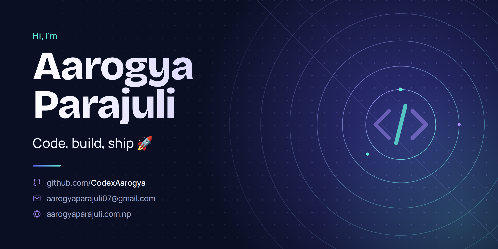

## Welcome! 

<!--  -->

<!-- Save the banner as assets/banner.png in your CodexAarogya/CodexAarogya repo -->

  

<h3 align="center">Data Scientist in the making · Data Engineer by ambition · Full-Stack Developer by craft</h3>

  
  
  
  

---

## 👋 About Me

I'm **Aarogya Parajuli**, a Computer Science and Engineering student at **Tribhuvan University, Nepal**, building a career at the intersection of **data, software and design**.

I turn raw data into reliable pipelines, models and products people can actually use. My background spans classical machine learning, statistical modeling, computer vision and NLP, backed by full-stack engineering and a design eye for UI/UX.

| | |
|---|---|
| 🎯 **Target roles** | Data Scientist · Data Engineer |
| 🔭 **Currently building** | Scalable backend systems and data pipelines |
| 🌱 **Currently exploring** | Modern data stack, MLOps and applied AI |
| 🏆 **Also enjoy** | Competitive programming and problem solving |
| 💬 **Ask me about** | Machine learning, data pipelines, full-stack development, UI/UX, embedded systems |

---

## 🧭 What I Do

| Focus | What it looks like in practice |
|---|---|
| **📊 Data Science** | Classical ML, statistical modeling, feature engineering, exploratory analysis, computer vision and NLP |
| **🏗️ Data Engineering** | ETL/ELT pipelines, workflow orchestration, dimensional modeling (star schema), warehousing, streaming |
| **🧩 Full-Stack Development** | REST APIs with Django and FastAPI, React front ends, async task queues, containerised deployment |
| **🎨 UI/UX Design** | Wireframes, prototypes and clean interfaces designed in Figma, built to be usable first |
| **🔌 Embedded & IoT** | Prototyping with Arduino, Raspberry Pi and ESP32 for sensing, automation and edge ideas |

---

## 🛠️ Tech Stack

Hover over an icon to see its name.

### 💻 Languages
&nbsp;&nbsp;
&nbsp;&nbsp;
&nbsp;&nbsp;
&nbsp;&nbsp;
&nbsp;&nbsp;

### 🤖 Machine Learning & Computer Vision
&nbsp;&nbsp;
&nbsp;&nbsp;
&nbsp;&nbsp;

### 📈 Data Analysis & Visualization
&nbsp;&nbsp;
&nbsp;&nbsp;
&nbsp;&nbsp;
&nbsp;&nbsp;
&nbsp;&nbsp;
&nbsp;&nbsp;

### 🏗️ Data Engineering
&nbsp;&nbsp;
&nbsp;&nbsp;
&nbsp;&nbsp;
&nbsp;&nbsp;
&nbsp;&nbsp;

### 🗄️ Databases & Caching
&nbsp;&nbsp;
&nbsp;&nbsp;
&nbsp;&nbsp;
&nbsp;&nbsp;

### ⚙️ Backend & Messaging
&nbsp;&nbsp;
&nbsp;&nbsp;
&nbsp;&nbsp;
&nbsp;&nbsp;
&nbsp;&nbsp;

### 🌐 Frontend
&nbsp;&nbsp;
&nbsp;&nbsp;
&nbsp;&nbsp;
&nbsp;&nbsp;
&nbsp;&nbsp;
&nbsp;&nbsp;

### ☁️ DevOps, Cloud & Tools
&nbsp;&nbsp;
&nbsp;&nbsp;
&nbsp;&nbsp;
&nbsp;&nbsp;
&nbsp;&nbsp;

### 🔌 Embedded & IoT
&nbsp;&nbsp;
&nbsp;&nbsp;
&nbsp;&nbsp;

### 🎨 Design & Creative
&nbsp;&nbsp;
&nbsp;&nbsp;
&nbsp;&nbsp;

---

  I'm open to <b>internships, collaborations and entry-level roles</b> in data science and data engineering. 
  If you're building something with data, I'd love to hear about it.

  
  
  

<i>Code, build, ship 🚀</i>

